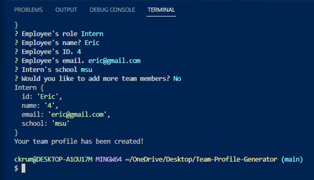
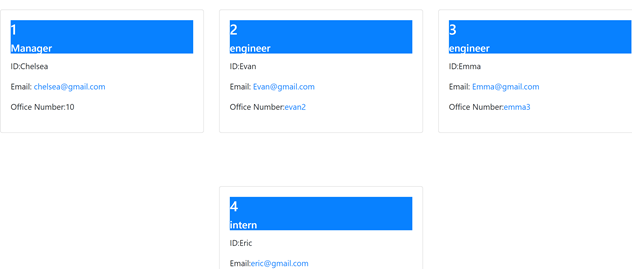

# Team-Profile-Generator

## Descrpition 
This command-line application accepts input from the user about their team and turns the information into a website listing their team's information. In the command-line, the user will enter "node index.js" and a set of questions will appear. First it will promt the user to answer questions about their teams Manager, such as their name, id, and email adress. Then the user may add more employees with the option of them being engineers or inters. If they select engineer, the user is prompted to enter the engineer's name, id, email, and github username. I the user selects intern, then the user wil be prompted to enter the intern's name, id, email, and school. Once the questions are done and all the information has been entered, a HTLM page will apprear with the information that has been entered. If the user clicks on an email adress or a github username, the page open to a new link where they may email the employee or see their github account.

## Installation
link to website: https://github.com/ckrum21/Team-Profile-Generator/
link to GitHub: https://github.com/ckrum21 

Install this website by cloning the code to your local devices.

software required to download this website:
* GitBash or other terminal
* Visual Studio Code

## Usage

The language used for this application is JavaScript, node, Jest, and Inquirer. The command-line application prints a HTML file when the questions are answered.

## Credits
Chelsea Krum 